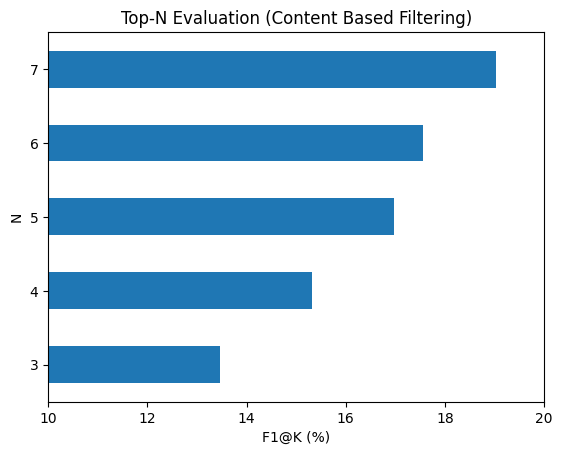

# Laporan Proyek Machine Learning - Gregorius Adi Pradana

## Project Overview

Dalam era digital yang berkembang pesat, sistem rekomendasi telah menjadi elemen penting, termasuk dalam industri ponsel. Dengan banyaknya model ponsel yang tersedia, konsumen sering mengalami kesulitan untuk memilih produk yang sesuai dengan kebutuhan mereka. Sistem rekomendasi ponsel dirancang untuk mengatasi permasalahan ini dengan menyediakan saran yang relevan berdasarkan preferensi dan kebutuhan individu. Salah satu alasan utama pentingnya sistem ini adalah tingginya volume informasi. Setiap tahun, ratusan model ponsel dirilis dengan spesifikasi, fitur, dan harga yang bervariasi, sehingga sulit bagi konsumen untuk membandingkan semuanya. Selain itu, kebutuhan personalisasi juga menjadi alasan utama, karena setiap konsumen memiliki preferensi unik, seperti kamera berkualitas tinggi, performa gaming, daya tahan baterai, atau harga yang terjangkau. Sistem ini juga membantu menghemat waktu, memberikan rekomendasi cepat tanpa perlu pencarian manual yang memakan waktu.

Sistem rekomendasi ini memberikan manfaat besar, baik bagi produsen maupun konsumen. Bagi produsen, sistem ini dapat meningkatkan penjualan dengan menarik lebih banyak pelanggan melalui rekomendasi personal. Selain itu, analisis data rekomendasi membantu produsen memahami preferensi pasar, memungkinkan mereka mengembangkan produk yang lebih sesuai dengan kebutuhan konsumen. Pengalaman belanja yang dipersonalisasi juga membantu membangun loyalitas merek. Di sisi lain, konsumen mendapatkan kemudahan dalam membuat keputusan dengan rekomendasi yang spesifik dan relevan. Sistem ini juga menghemat waktu konsumen dalam menemukan ponsel yang sesuai dan memberikan pengalaman belanja yang lebih memuaskan. Dengan demikian, sistem rekomendasi berbasis content-based filtering dan collaborative filtering menjadi solusi cerdas untuk memenuhi kebutuhan pasar dan memberikan pengalaman yang lebih baik bagi semua pihak yang terlibat.

Pendekatan yang digunakan dalam sistem rekomendasi melibatkan dua metode utama, yaitu content-based filtering dan collaborative filtering. Content-based filtering bekerja dengan menganalisis karakteristik ponsel, seperti prosesor, RAM, kapasitas penyimpanan, kamera, dan harga, kemudian mencocokkannya dengan preferensi pengguna. Misalnya, jika pengguna menginginkan ponsel dengan kamera berkualitas tinggi, sistem akan merekomendasikan model dengan fitur serupa. Sementara itu, collaborative filtering memanfaatkan data historis dari pengguna lain. Jika banyak pengguna dengan preferensi serupa menyukai model tertentu, sistem akan merekomendasikan model tersebut kepada pengguna baru dengan profil yang mirip.

Penerapan metode Content-Based Filtering dalam sistem rekomendasi ponsel dapat memberikan rekomendasi yang lebih tepat dengan mempertimbangkan preferensi spesifik pengguna, seperti kapasitas baterai, prosesor, dan ukuran layar. Suatu penelitian mengulas penerapan model berbasis konten yang menggunakan berbagai faktor untuk menyesuaikan rekomendasi produk (termasuk ponsel) dengan preferensi pengguna [1]. Pendekatan lain yang lebih canggih mempertimbangkan konteks pengguna, seperti waktu dan lokasi, untuk memberikan rekomendasi yang lebih relevan dan personal [2]. Sementara itu, Collaborative Filtering digunakan dalam sistem rekomendasi ponsel dengan memanfaatkan data dari pengguna lain yang memiliki preferensi serupa, yang efektif untuk menemukan produk baru berdasarkan pola perilaku kolektif [3]. Metode-metode ini, meskipun berbeda, memberikan kontribusi besar dalam meningkatkan relevansi rekomendasi ponsel untuk pengguna individu.

Referensi :\
[1] [Development of Content-Based Filtering Model for Recommendation System Using Multiple Factors related to object Preference](https://ieeexplore.ieee.org/document/10639015)\
[2] [Context-Aware Recommender System based on Content Filtering](https://ieeexplore.ieee.org/document/9620478)\
[2] [A Survey of Collaborative Filtering-Based Recommender Systems for Mobile Internet Applications](https://ieeexplore.ieee.org/document/7479487)

## Business Understanding

### Problem Statements
- Pengguna mengalami kesulitan dalam memilih ponsel yang sesuai dengan kebutuhan pribadi mereka.
- Terlalu banyak pilihan ponsel dengan spesifikasi yang serupa, yang membuat pengguna bingung dalam menentukan pilihan yang tepat.
- Sistem rekomendasi saat ini tidak cukup personal dan relevan dengan preferensi individu pengguna.
- Minimnya data interaksi pengguna dengan ponsel sebelumnya menyulitkan sistem dalam memberikan rekomendasi yang akurat (terutama pada kasus cold start).
- Tingkat konversi penjualan ponsel bisa lebih tinggi dengan sistem rekomendasi yang lebih tepat dan didasarkan pada data preferensi pengguna.

### Goals
- Meningkatkan pengalaman pengguna dengan memberikan rekomendasi ponsel yang sesuai dengan preferensi mereka (berdasarkan fitur dan spesifikasi produk yang relevan). Dengan metode Content-Based Filtering, rekomendasi disesuaikan dengan preferensi spesifik pengguna terkait fitur produk seperti ukuran layar, kapasitas baterai, dan kualitas kamera.
- Menyaring ponsel yang memiliki fitur serupa dengan yang telah dipilih oleh pengguna sebelumnya untuk mengurangi kebingungan dalam memilih produk. Dengan menggunakan Content-Based Filtering, sistem akan menyoroti ponsel yang memiliki karakteristik atau spesifikasi yang mirip dengan produk yang sebelumnya dipilih atau disukai oleh pengguna.
- Memberikan rekomendasi yang lebih personal dan relevan dengan memanfaatkan data preferensi pengguna secara lebih efektif. Collaborative Filtering akan menganalisis data perilaku pengguna lain yang memiliki preferensi serupa, sehingga bisa memberikan rekomendasi yang lebih terpersonalisasi untuk setiap pengguna.
- Mengatasi masalah cold start dengan memanfaatkan metode Content-Based Filtering yang tidak memerlukan data historis pengguna untuk memberikan rekomendasi yang relevan. Dengan Content-Based Filtering, meskipun data interaksi pengguna terbatas, sistem tetap dapat memberikan rekomendasi berdasarkan atribut ponsel yang relevan dengan kebutuhan pengguna.
- Meningkatkan konversi penjualan ponsel dengan menyarankan model yang lebih sesuai dengan kebutuhan pelanggan, yang akhirnya mendorong pembelian yang lebih tepat. Sistem rekomendasi yang lebih akurat dan relevan, berkat Content-Based Filtering dan Collaborative Filtering, berpotensi meningkatkan kepuasan pengguna dan mendorong keputusan pembelian yang lebih baik.

    ### Solution statements
    - Menggunakan pendekatan content based filtering berbasis cosine similarity.
    - Menggunakan pendekatan collaborative filtering berbasis Singular Value Decomposition (SVD).
    - Melakukan hyperparameter tuning pada metode content based filtering untuk mengetahui fitur apa yang paling relevan untuk memberikan rekomendasi dan berapa jumlah rekomendasi yang optimal.
    - Melakukan hyperparameter tuning pada metode collaborative filtering untuk mendapatkan representasi user-item yang paling relevan berdasarkan faktor laten dan berapa jumlah rekomendasi yang optimal.
    

## Data Understanding
Dataset Cellphones Recommendations terdiri dari 3 berkas, yaitu **cellphone data.csv** yang berisi 33 data tentang ponsel paling populer di AS pada tahun 2022, **cellphones users.csv** yang berisi 99 data pengguna, dan **cellphones ratings.csv** yang berisi 990 data rating dari pengguna untuk ponsel terkait. Rating diperoleh dengan melakukan survei pada Mechanical Turk. Setiap peserta diberikan 10 ponsel acak, dan ia diminta untuk menunjukkan seberapa besar kemungkinan ia akan membeli setiap ponsel dengan harga yang diberikan, pada skala dari 1 (sangat tidak mungkin) hingga 10 (sangat mungkin). Setiap peserta diminta untuk menambahkan informasi pribadi: usia, jenis kelamin, dan pekerjaan.

Atribut pada **cellphones data.csv**
* **cellphone_id :** id setiap ponsel
* **brand :** merek ponsel
* **model :** tipe ponsel
* **operating system :** sistem operasi (Android atau iOS)
* **internal memory :** ukuran memori (GB)
* **RAM :** RAM (GB)
* **performance :** peringkat kinerja (AnTuTu)
* **main camera :** resolusi kamera utama (MP)
* **selfie camera :** resolusi kamera depan (MP)
* **battery size :** ukuran baterai (mAh)
* **screen size :** ukuran layar (inch)
* **weight :** berat (gr)
* **price :** harga dari Amazon dan Best-Buy (pada Agustus 22)
* **release date :** tanggal rilis

Atribut pada **cellphones users.csv**
* **user_id :** id pengguna
* **age :** umur pengguna 
* **gender :** gender pengguna
* **occupation :** pekerjaan pengguna

Atribut pada **cellphones ratings.csv**
* **user_id :** id pengguna
* **cellphones_id :** id ponsel
* **rating :** rating dari pengguna pada ponsel (1-10)

[Kaggle](https://www.kaggle.com/datasets/meirnizri/cellphones-recommendations)

Berdasarkan exploratory data analysis didapatkan hasil sebagai berikut

**Dataset Rating**

* Terdapat 990 data rating dari user untuk ponsel

* Terdapat outlier pada 1 data di mana rating 18 di mana seharusnya 1-10 

* Terdapat 99 user yang memberikan rating dan 33 ponsel yang diberikan rating dengan skala 1-10

* Tidak terdapat missing value

* Tidak terdapat record yang duplikat

* Setiap user memberikan rating pada 10 ponsel berbeda

**Dataset Data**

* Terdapat 33 data spesifikasi ponsel yang unik

* Tidak terdapat missing value

* Tidak terdapat record yang duplikat

## Data Preparation

- **Content based filtering**
    * **Label generation :**  proses mendapatkan label untuk content based filtering. Label pada content based filtering merupakan pasangan dari setiap **user_id** dengan **cellphone_id** yang memiliki minimal 2 buah rating di mana rating >= 8 (asumsi rating ponsel yang disukai). Setiap user_id minimal memiliki 2 buah rating karena salah satu **cellphone_id** yang bersesuaian akan digunakan untuk mendapatkan rekomendasi sehingga **cellphone_id** lainnya dapat digunakan untuk mengevaluasi relevansi rekomendasi tersebut.
    * **Feature engineering :** untuk mendapatkan fitur yang lebih optimal seperti **year** (tahun) dibandingkan dengan **release date** (tanggal rilis)
    * **Split attributes :** memisahkan atribut numerik dan kategorikal karena membutuhkan penanganan yang berbeda
    * **One hot encoding :**  data kategori diubah menjadi numerik agar dapat dilakukan modelling
    * **Feature scaling :** data numerik dinormalisasi untuk menyamakan rentang nilai menjadi antara 0-1
    * **Combine attributes :** Atribut numerik dan kategori digabungkan untuk membentuk satu kesatuan fitur

- **Collaborative filtering**
    * **Train-test split :** agar performa model lebih valid maka model diuji pada data yang berbeda dari data training
    * **Label generation :** proses mendapatkan label untuk collaborative filtering. Label pada collaborative filtering merupakan pasangan dari setiap user_id dengan cellphone_id yang memiliki rating >= 8 (asumsi rating ponsel yang disukai)
    * **Pivot table :** membuat pivot table yang berisi rating dari setiap user untuk setiap ponsel yang ada
    * **FIll missing value :** mengisi nilai NaN dari pivot table yang diakibatkan oleh tidak adanya rating yang diberikan user pada ponsel tertentu. Ponsel yang tidak diberi rating akan diberi nilai 0

## Modeling

- **Content Based Filtering**
    Model content based filtering yang digunakan merupakan model content based filtering berbasis cosine similarity. Tahapan dalam metode ini dijelaskan sebagai berikut:
    1. Membuat matriks similaritas berdasarkan matriks item (ponsel) yang berisi fitur-fitur item (ponsel) tersebut
    2. Mengambil salah satu **cellphone_id** sebagai item acuan
    3. Mencari **cellphone_id** yang memiliki similaritas tinggi dengan item acuan selain item acuan tersebut berdasarkan matriks similaritas
    4. Mendekodekan **cellphone_id** hasil rekomendasi menjadi nama ponsel untuk disajikan
    
    Kelebihan :
    * Efektif pada kondisi cold start karena tidak membutuhkan data interaksi pengguna lain dalam memberikan rekomendasi
    * Efektif ketika pengguna menyukai ponsel berdasarkan kemiripan spesifikasinya
    
    Kekurangan :
    * Rekomendasi kurang bervariasi karena hanya berfokus pada produk yang mirip dengan produk yang disukai pengguna sehingga dapat mengurangi kepuasan pengguna dalam jangka panjang.
    * Kurang efektif jika pengguna menyukai ponsel dengan pola yang bervariasi tidak bergantung spesifikasinya.

    Output rekomendasi :\
    
    

- **Collaborative Filtering**
    Model collaborative filtering yang digunakan merupakan model collaborative filtering berbasis matrix factorization yaitu metode Singular Value Decomposition (SVD). Tahapan dalam metode ini dijelaskan sebagai berikut:
    1. Mendekomposisi dan merekonstruksi matriks user-item (pivot table) dengan k fitur laten
    2. Mengambil salah satu **user_id** sebagai user acuan
    3. Mencari prediksi rating dari **user_id** untuk **cellphone_id** yang belum dirating oleh user
    4. Mendekodekan **cellphone_id** hasil rekomendasi menjadi nama ponsel untuk disajikan
    
    Kelebihan :
    * Dapat menemukan pola yang kompleks antara pengguna dengan ponsel sehingga rekomendasi menjadi lebih mendalam. Dapat menemukan ponsel yang mungkin disukai pengguna meskipun secara garis besar belum diketahui oleh pengguna tersebut karena berbeda tipe dengan ponsel yang telah disukai sebelumnya.
    * Rekomendasi yang diberikan lebih beragam karena mengandalkan data dari banyak pengguna. Dapat menemukan produk yang mungkin belum diketahui pengguna tetapi disukai oleh kelompok pengguna lain dengan preferensi serupa sehingga mungkin disukai juga oleh pengguna tersebut.
    * SVD sangat efektif dalam menangani dataset besar dengan banyak pengguna dan produk karena memanfaatkan dekomposisi matriks untuk menyarankan ponsel secara lebih efisien.
    
    Kekurangan :
    * Kurang efektif dalam keadaaan cold start karena SVD sangat bergantung pada data pengguna sebelumnya, sehingga kesulitan dalam memberikan rekomendasi untuk pengguna baru (yang belum memiliki cukup data interaksi) atau ketika terdapat produk baru.
    * SVD rawan terhadap overfitting dengan data pelatihan, sehingga menghasilkan rekomendasi yang kurang generalisabel untuk data baru atau data yang tidak terduga.
    * Memerlukan sumber daya komputasi yang besar karena proses dekomposisi matriks memerlukan banyak daya komputasi, terutama ketika datasetnya besar, yang dapat menjadi masalah dalam aplikasi dengan sumber daya terbatas.
    
    Output rekomendasi :\
    
    

## Evaluation
Pada bagian ini Anda perlu menyebutkan metrik evaluasi yang digunakan. Kemudian, jelaskan hasil proyek berdasarkan metrik evaluasi tersebut.

Metrik evaluasi yang digunakan adalah presisi@k, recall@k, dan f1@k. Seluruh metrik tersebut dapat dihitung dengan formula sebagai berikut.

Presisi@k = Jumlah rekomendasi yang relevan / Jumlah rekomendasi\
Recall@k = Jumlah rekomendasi yang relevan / Jumlah relevan\
F1@k = (2 * Presisi * Recall) / (Presisi + Recall)\

Metrik presisi@k menjelaskan seberapa banyak persentase rekomendasi yang relevan dari seluruh rekomendasi yang diberikan oleh sistem. Metrik recall@k menjelaskan seberapa banyak persentase rekomendasi yang relevan dari seluruh rekomendasi yang dianggap relevan oleh user. Metrik f1@k merupakan kombinasi keseimbangan dari presisi dan recall. Model terbaik tidak dapat diputuskan menggunakan presisi@k atau recall@k saja karena presisi@k tidak memperhitungkan item yang relevan yang tidak direkomendasikan, sedangkan recall@k tidak memperhitungkan kualitas rekomendasi (nilainya bisa tinggi meskipun banyak item yang kurang relevan). Oleh karena itu, model terbaik diputuskan menggunakan metrik f1@k karena memberikan keseimbangan antara kuantitas dan kualitas rekomendasi.

Berdasarkan hasil diatas tampak bahwa fitur paling optimal pada content based filtering untuk menentukan rekomendasi ponsel pada pengguna adalah seluruh fitur kecuali ukuran layar ("No Screen"). Hal ini berarti, berdasarkan rating yang diberikan oleh pengguna dalam database, secara umum pengguna kurang mempertimbangkan ukuran layar dalam memilih dan menyukai suatu ponsel. Sebaliknya pengguna sangat memperhatikan merek dalam memilih ponsel. Hal ini ditunjukkan oleh performa yang rendah dari model content based filtering ketika fitur **brand** tidak dipertimbangkan dalam pemberian rekomendasi.

Berdasarkan hasil diatas tampak bahwa jumlah faktor laten yang paling optimal pada collaborative filtering adalah 15. Nilai tersebut berhasil menagkap pola preferensi pengguna secara optimal sehingga model memiliki kemampuan generalisasi yang tinggi tetapi tetap dapat menangkap pola yang penting. Faktor laten dengan jumlah 5 dan 10 belum mampu menagkap pola dari preferensi pengguna sehingga performanya cenderung rendah. Akibatnya, bisa jadi semua pengguna dengan preferensi sedikit berbeda akan menerima rekomendasi yang sama karena pola penting dari preferensi pengguna diabaikan. Faktor laten dengan jumlah 20 dan 25 menangkap terlalu banyak pola spesifik sehingga performanya tidak sebaik 15. Akibatnya, bisa jadi jika terdapat satu pengguna memberikan rating ekstrem pada item tertentu, model bisa memberikan rekomendasi bias untuk item itu.

Berdasarkan hasil diatas tampak bahwa jumlah rekomendasi paling optimal pada content based filtering dan collaborative filtering adalah 7. Nilai recall cenderung meningkat secara signifikan seiring dengan meningkatnya jumlah item yang direkomendasikan. Hal ini berarti jumlah rekomendasi yang relevan meningkat seiring dengan meningkatnya jumlah item yang direkomendasikan. Namun, disisi lain, jumlah item yang kurang relevan juga meningkat sehingga nilai presisi cenderung stagnan.

